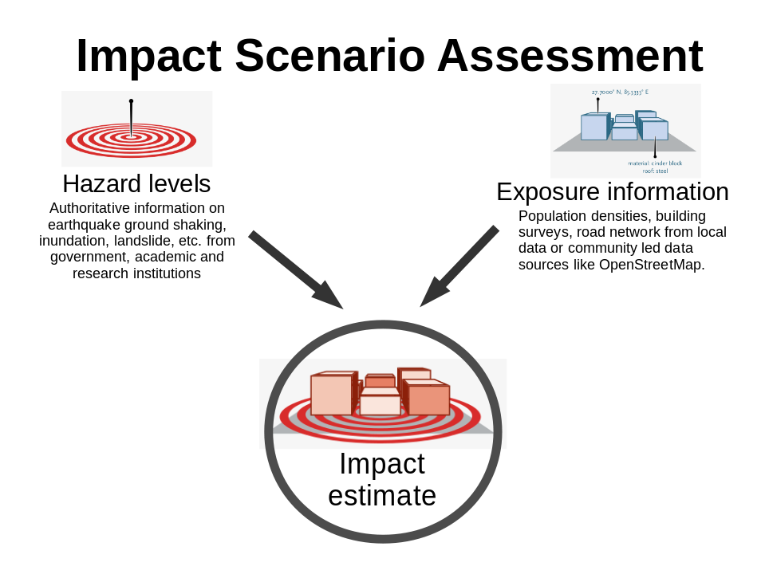

=======================================
Using InaSAFE plugin in QGIS
=======================================
.. Copy pasted from Inasafe docs http://inasafe.org/tutorial-docs/tutorial.html
   Original license of this section is CC-BY, thus it should be a separate material
   QGIS. https://groups.google.com/forum/?hl=en&fromgroups=#!topic/inasafe-users/494hpvMtF4o

InaSAFE is a plugin for QGIS. It aims to produce realistic natural
hazard impact scenarios for better planning, preparedness and response
activities, using hazard and exposure geographic data.  

During this training, you will explore the different components of
InaSAFE plugin and their usage for an easy-to-use risk and impact scenarios
assessments. 

Concept
-----------

To effectively prepare for future floods, earthquakes or tsunami you must first 
understand the likely impacts that need to be managed. For example, to prepare 
contingency plans for a severe flood, emergency managers need to 
answer questions like:

* what are the areas likely to be affected;
* how many people will need to be evacuated and sheltered;
* which schools will be closed;
* which hospitals can still take patients; and
* what roads will be closed?

How does it work?
---------------------

InaSAFE provides a simple but rigorous way to combine data from scientists, 
local governments and communities to provide insights into the likely impacts 
of future disaster events. The software is focused on examining, in detail, 
the impacts by a single hazard would have on specific sectors.

At the end of this material, you will be able to:

* install a plugin in QGIS and understand its usage for spatial analysis;
* understand what are hazard and exposure data and how they can be used to
  estimate impacts;
* learn how to prepare the data to be able to use it in InaSAFE;
* perform a risk scenario using flood and earthquake data;
* analyze estimated impact of the example scenarios;
* learn how to print and save the result of the simulation.

.. toctree::
   :maxdepth: 2
   :numbered:

   install_inasafe.rst
   using_inasafe.rst

.. raw:: latex
   
   \pagebreak[4]
