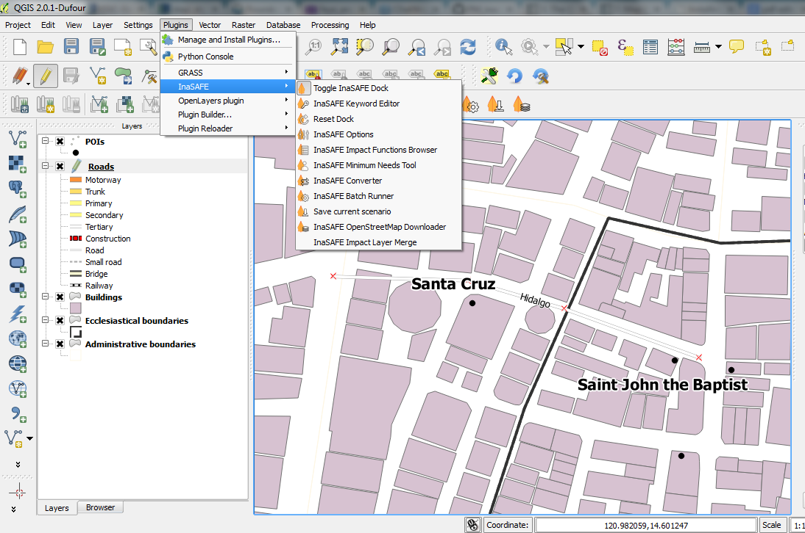

===============================================
Install InaSAFE Plugin from QGIS Repository
===============================================

.. note::
   InaSAFE is a plugin for QGIS, so QGIS must be installed first via
    QGIS Python Plugin Repository.

To install InaSAFE, use the plugin manager in QGIS:

1. Click the menu 
:menuselection:`Plugins -->` |plugin_installer| :guilabel:`Manage and install plugins...`. 

2. Search for 'InaSAFE', select it and click the install button.
The plugin will now be added to your plugins menu.

From InaSAFE test repository
----------------------------

During development of an InaSAFE version, developers make a test version of
the software for people to trial. Here are the instructions on how to install
this test version.

1. :menuselection:`Plugins --> Manage and install plugins...`
2. :guilabel:`Click` on **Settings** tab and :guilabel:`Check`
   *Show also experimental plugins*

   .. image:: images/inasafe/installer_options.png
      :align: center

3. :guilabel:`Click` on **Settings** tab and :guilabel:`Add` a new repository

   .. image:: images/inasafe/python_installer.png
      :align: center

4. Type the following into the Repository details

   **Name:**   InaSAFE Test
   **URL:**    http://experimental.inasafe.org/

   .. image:: images/inasafe/repository_details.png
      :align: center

5. :guilabel:`OK`

6. You should now have 2 repositories connected, :guilabel:`Click` on
   **Plugins**

   .. image:: images/inasafe/connected.png
      :align: center

7. :guilabel:`Upgrade all`

   .. image:: images/inasafe/upgradeable.png
      :align: center

From Zip Archive
----------------

.. warning:: This installation method is not recommended unless you have no
   internet access or wish to use a specific version of InaSAFE.
   Please rather install using the plugin repository described above.

We make regular releases of the InaSAFE plugin and they are available at
http://plugins.qgis.org/plugins/inasafe/.
Simply choose the most recent (i.e. the one with the largest version number)
and save it to your hard disk.

Now extract the zip file into the QGIS plugins directory.

.. warning::
   Depending on your version of QGIS the plugin directory is either
   under a subdirectory of .qgis (QGIS versions < 2.0) or .qgis2 (QGIS version
   >= 2.0).

That also means depending on your Operating System (Windows, Linux,
OSX) in combination with the version of QGIS, the directory containing the
plugins will be in:

- Windows: :file:`C:\\Users\\<your username>\\.qgis(2)\\python\\plugins\\`.
- Linux: :file:`~/.qgis(2)/python/plugins/` (where "~" means
  :file:`/home/<your username>/`
- OSX: TODO

.. note::
   :file:`.qgis(2)` means that the directory is either called
   :file:`.qgis` or :file:`.qgis2`.

Example:
In Windows Operating System using QGIS 2.0 you would do following:

Locate the directory
:file:`C:\\Users\\<your username>\\.qgis2\\python\\plugins`.

After extracting the plugin, it should be available as:

:file:`C:\\Users\\<your username>\\.qgis2\\python\\plugins\\inasafe\\`.

Mac and Linux users need to follow the same procedure but instead the plugin
directory will be under the $HOME directory:

:file:`~/.qgis2/python/plugins/`

Once the plugin is extracted, start QGIS and enable it from the plugin manager.
To do this open the plugin manager
:menuselection:`Plugins --> Manage and install plugins...` and type :samp:`insafe` into
the search box.
You should see the InaSAFE plugin appear in the list.
Now tick the checkbox next to it to enable the plugin.

   Plugin Manager

Downgrade the InaSAFE plugin to a selected version
---------------------------------------------------------

In case you have to use an older Version of QGIS or just want to
install a specific version of the InaSAFE plugin into QGIS you have
to do the following steps:

1. Fetch the plugin manually from http://plugins.qgis.org/plugins/inasafe/ by
   clicking on your preferred version number then clicking download.
2. Remove your local copy from :file:`~/.qgis2/python/plugins/inasafe`
   That would mean delete the folder :file:`inasafe` which is inside your
   :file:`~/.qgis2/python/plugins` directory.
   For Windows user this :file:`inasafe` directory would be in
   :file:`C:\\Users\\<your username>\\.qgis2\\python\\plugins`
3. Extract the downloaded version into that folder (Means to create the
   :file:`inasafe` folder inside :file:`~/.qgis2/python/plugins` again
4. Restart QGIS

Enable InaSAFE Plugin in QGIS
.............................
1. Now you will need to add the InaSAFE panel on your QGIS interface. For that,
select :menuselection:`Toggle InaSAFE Dock` in the InaSAFE plugin scroll list.

 
The InaSAFE dock panel will then appear on the right of your QGIS window.

It is the main way to interact with the tools that are provided in InaSAFE.

Also, an InaSAFE icon will appear on the QGIS toolbar.

.. image:: images/inasafe/inasafe_plugin_toolbar.png
   :align: center
   :width: 300 pt

.. Note::
   InaSAFE may not install properly depending on your operating system. You may 
   need to install additional Python modules in order to proceed.

.. raw:: latex
   
   \pagebreak[4]
