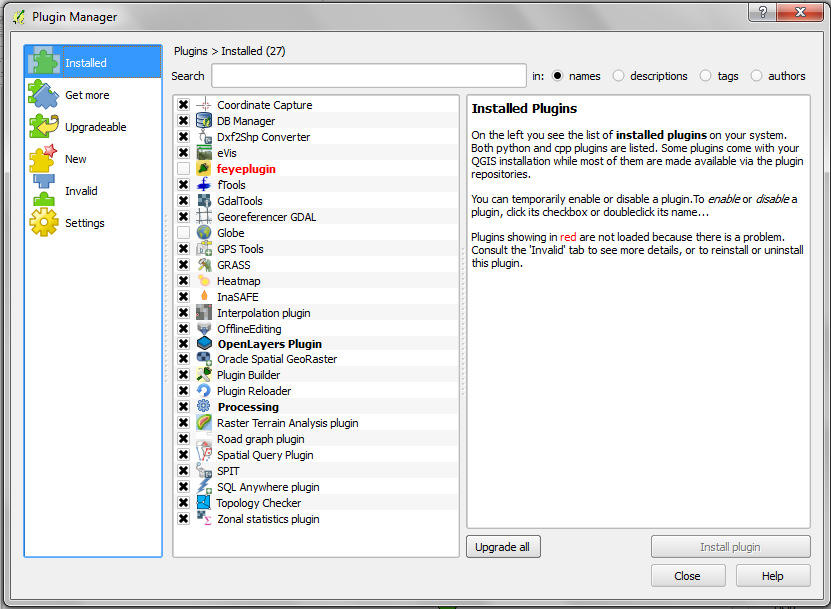
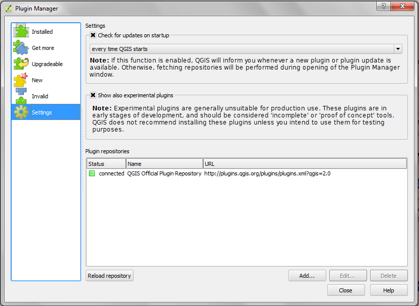
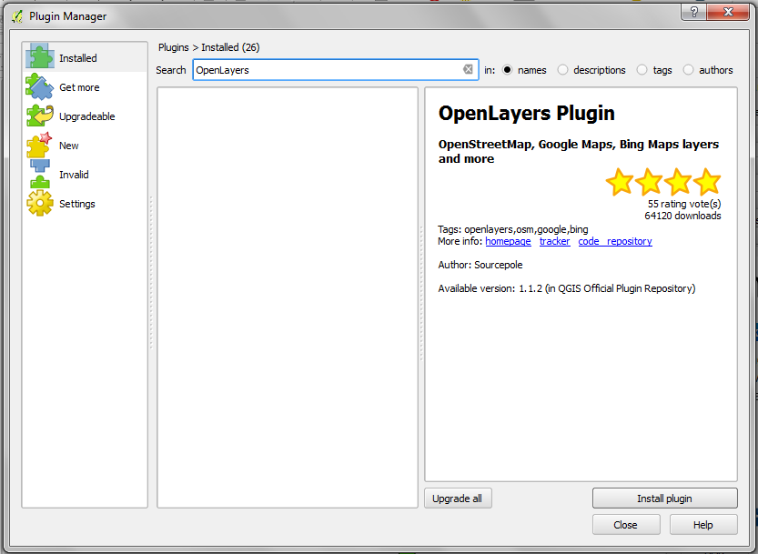

===============
QGIS Plugins
===============

QGIS was designed with a flexible and extensible plug-in architecture. This 
allows new features/functions to be easily developed and added to the 
application. Many of the features in QGIS are implemented as plug-ins. Many QGIS 
users are developing their own plug-ins and there is a wealth of plug-ins 
available in the QGIS website.

* **Core Plug-ins** are maintained by the QGIS Development Team and are 
  automatically part of every QGIS distribution.
* **External Plug-ins** are currently all written in Python. They are stored in 
  external repositories and maintained by the individual authors. 

.. note::
   A working Internet connection is required to download and update plugins.

Add new plugins using Python Plugin Installer 
-----------------------------------------------

1. In order to download and install an external Python plugin, click the menu 
:menuselection:`Plugins -->` |plugin_installer| :guilabel:`Manage and Install Plugins`. 

2. Click the :guilabel:`Settings` 
tab.

**Settings Tab** - contains a list of plugin repositories available. By 
default, only the QGIS Official Repository is enabled. You can add several 
user-contributed repositories, including the central QGIS Contributed 
Repository and other external repositories by clicking the :guilabel:`Add…` 
button and providing 
the repository details. 

.. verify if this repor is still working

3. Click the :guilabel:`Add…` button. In the :guilabel:`Name` field, type 
``QGIS Contributed Repository`` and type ``http://pyqis.org/repo/contributed`` 
in the :guilabel:`URL` field. Click :guilabel:`OK` to access the repository.

4. Go back to the list of plugins by clicking the 
:guilabel:`Installed` tab.

**Installed tab** - this tab list all available plugins.  Each plugin can be either: 

* **Get More** - the plugin is available in the repository, but is not installed yet. 

* **installed** - the plugin is already installed. If it is also available in any 
  repository the :guilabel:`Reinstall plugin` button will be enabled.  

* **upgradeable** - the plugin is installed, but there is an updated version 
  available. In this case, the :guilabel:`Upgrade plugin` button will be enabled.

* **invalid** - the plugin is installed, but is broken or incompatible with 
  your version of QGIS. The reason will be explained in the plugin description field.  

5. Find and select the :guilabel:`Openlayers Plugin` in the list.  Click 
:guilabel:`Install plugin` button.

7. Once installed, close the 
:guilabel:`Plugin Manager` window.

.. raw:: latex
   
   \pagebreak[4]
