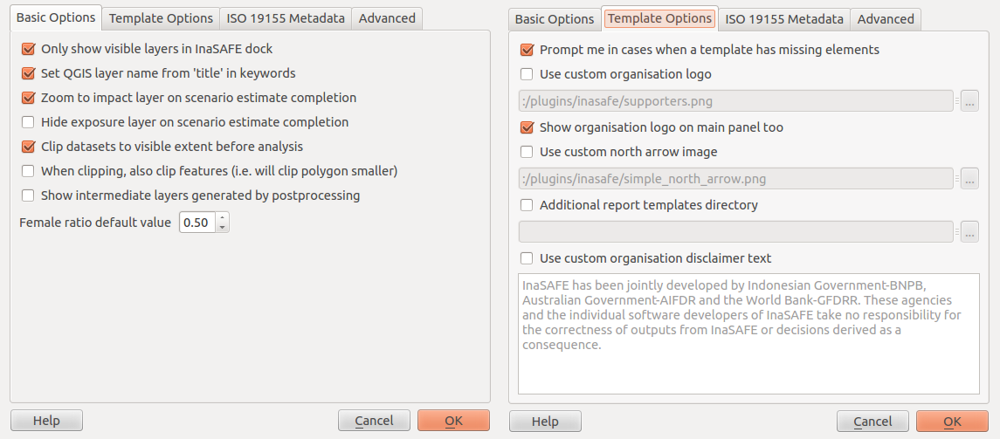

=======================================
Using InaSAFE
=======================================

InaSAFE Options
...............

The InaSAFE plugin provides an options dialog which allows you to define
various options relating to how InaSAFE will behave. 

1. The options dialog can be
launched by clicking on the InaSAFE plugin toolbars options icon (as shown
below) or from QGIS :menuselection:`Plugins --> InaSAFE --> InaSAFE Options`.

 
2. Then the dialog will appear, looking something like 
this:

As you can see this dialog is divided into four tabs namely:

* `Basic Options`
* `Template Options`
* `ISO 19155 Metadata`
* `Advanced`

The following options are available on the `Options Dialog`:

Basic Options
-------------
* :guilabel:`Only show visible layers in the InaSAFE dock` : This option will
  determine whether **all** hazard and impact layers should be listed in the
  |project_name| dock's combo boxes or (when checked) only visible layers.
* :guilabel:`Set QGIS layer name from 'title' in keywords` : This option will
  cause QGIS to name layers in the :guilabel:`Layers tree` using the `title`
  keyword in the layer's keywords file.
  If the layer has no 'title' in its keywords, or it has no keywords at all,
  the normal QGIS behaviour for naming layers will apply.
* :guilabel:`Zoom to impact layer on scenario estimate completion` : This
  option will cause the map view to zoom in/out in order to completely contain
  the |project_name| impact scenario map output when an analysis completes.
* :guilabel:`Hide exposure layer on scenario estimate completion` : This
  option will cause QGIS to turn off the exposure layer used when
  |project_name| completes the current analysis.
  You can re-enable the layer visibility again by checking its checkbox in
  the legend.
* :guilabel:`Clip datasets to visible extent before analysis` : This option
  will cause QGIS to clip hazard and exposure layers to the currently visible
  extent on the map canvas.
* :guilabel:`When clipping, also clip features (e.g. will clip polygon
  smaller)`:
  This option will clip any polygons that extend beyond the analysis extents
  so that they are contained by the analysis extents. For example if you have
  a flood hazard polygon layer that extends far beyond your area of interest,
  the flood polygons will be reduced so that only the part inside of your
  area of interested is retained. This can speed up processing time somewhat.
* :guilabel:`Show intermediate layers generated by postprocessing` : This
  option will cause QGIS to show the intermediate files generated by the
  postprocessing steps in the map canvas.
* :guilabel:`Female ratio default value` : This is the default female to total
  population ratio used for generating Gender breakdowns

Template Options
----------------
* :guilabel:`Prompt me in cases when a template has missing elements`: When
  enabled, this option will cause InaSAFE to prompt user when a template has
  missing element when the user try to print the report or open it in the
  composer.
* :guilabel:`Use custom organisation logo`: This option is used to determine
  a custom logo that will be used as organisation logo in the pdf of your
  impact scenario project. If this option is disabled, InaSAFE will use the
  default organisation logo.
  See :ref:`toolbar_reports` in the |project_name| User-Manual for more
  information on the reports.
* :guilabel:`Show organisation logo in the main panel too`: If this is enabled
  then the selected organisation logo (if any) will be displayed in the bottom
  of the inasafe dock panel.
* :guilabel:`Use custom north arrow image`: This option is used to determine
  a custom north arrow that will be used as north arrow image in the pdf of
  your impact scenario project. If this option is disabled, InaSAFE will use the
  default north arrow image.
* :guilabel:`Additional report templates directory`: This option is used to
  determine a directory with custom templates. Templates from this directory
  will be available for usage when generating report on your impact scenario
  project.
* :guilabel:`Use custom organisation disclaimer text`: This option is used to
  change default disclaimer text, printed in reports. If this is enabled, just
  enter your own text and it will be used instead of the default one.
  See :ref:`toolbar_reports` in the |project_name| User-Manual for more
  information on the reports.

Advanced
--------

* :guilabel:`Keyword cache for remote datasources` : This option is used to
  determine where keywords are stored for datasets where it is not possible
  to write them into a .keywords file.
  See :ref:`keywords_system` in the |project_name| User-Manual for more
  information on the keywords system.
* :guilabel:`Help to improve InaSAFE by submitting errors to a remote server` :
  This option, when enabled, will submit diagnostic information back to an
  |project_name| project server in the event of any error taking place that
  we are able to trap.
  The information provided is useful to the |project_name| team to improve
  the robustness of the software we produce and to spot trends in issues
  people encounter.
  Please note the warning text below this option which is included here in
  full:

.. note::
   The above setting requires a QGIS restart to disable/enable.
   Error messages and diagnostic information will be posted to
   http://sentry.linfiniti.com/inasafe-desktop/ .
   Some institutions may not allow you to enable this feature - check with
   your network administrator if unsure.
   Although the data is submitted anonymously, the information contained in
   tracebacks may contain file system paths which reveal your identity or
   other information from your system.

* :guilabel:`Enable developer mode for dock webkit (needs restart)` :  With
  this option enabled, you can right click on the report area and use the
  webkit debug tools to debug the output.
  **This option is intended for advanced users only.**
* :guilabel:`Use QGIS zonal statistics` : With this button you can toggle
  between using QGIS internal zonal statistics or the one that comes with
  |project_name|

.. note::
   You can click on the :guilabel:`Help` button at any time and it
   will open the help documentation browser to this page.

.. note::
   Pressing :guilabel:`Cancel` at any time will close the options dialog and
   any changes made will **not** be applied.
   Pressing :guilabel:`OK` at any time will close the options dialog and any
   changes made **will** be applied immediately.

.. note:: The exact button order shown on this dialog may differ depending on
   your operating system or desktop environment.

Adjust Projection
.................

Before continuing we need to turn one more QGIS functionality on, to enable all
data layers display in one projection (`WGS-84`).

1. For that, go to QGIS 
On the lower right, `Click` |crs| :guilabel:`CRS status`.

2. Tick the :guilabel:`Enable on  the fly CRS transformation` box. And then :guilabel:`OK`.

Now, any data layer that we will integrate into our project will be adjusted on
the same coordinate.

Exploring InaSAFE Plugin
........................

1. You can drag and drop the dock panel to reposition it in the user interface.
For example, dragging the panel towards the left margin of the QGIS
application will dock it to the left side of the screen.

2. Depending on your preference you could show the :guilabel:`Layer` and :guilabel:`InaSAFE` 
panel at the same time.

Or have the :guilabel:`Layer` and :guilabel:`InaSAFE` panels in a tab systems.

Or for more convenience, having them on top of each other.

The InaSAFE panel contains 3 sections: **Questions, Results** and **Buttons.**
We will explore those sections one by one.

The Questions Section
.....................

The intention of InaSAFE is to make it really simple and easy to perform your
impact analysis. The Questions area provides a simple way for you to formulate
what it is you want to find out? All questions are formulated in the form:

*In the event of* **[hazard]** *how many* **[exposure]** *might* **[impact].**

For example:
In the event of a **flood** how many **buildings** might be **closed**?

In order to answer such question, InaSAFE developers have built a number of
impact functions that cover risk scenarios such as flood, tsunami, volcanic ash
fall, earthquake and so on. In our case, we will use the flood impact function.

To answer our question **In the event of a flood, how many buildings might be
closed**, we need to complete all the areas in the Questions section: hazard,
exposure, impact.

Hazard
......

Hazard is the physical event that creates the risk.

A hazard (in **the event of**) may be represented as a raster layer or as an
area (polygon). For example:

* **Raster:** where each pixel in the raster represents the current flood depth
  following an inundation event.
* **Polygon:** where it has been identified that flood has existed in that area
  (this will not have depth related information)

For our exercise, we will use Tacloban data. Those data
are on your computer at :file:`~/inasafe_data_ph/`. 

1. We will add the hazard layer in the InaSAFE dock. For that, we need to add
the hazard layer from QGIS first. The flood layer is in a raster format, so we
will go to the QGIS menu, click on :menuselection:`Layer --> Add Raster Layer`.

.. note::
   InaSAFE 2.0 and later is now allowing to import hazard layer in a vector format. 

2. Once you click on that, a pop-up window will appear where you will have to
fetch your flood data.  Please select the
:file:`noah-Leyte_TaclobanCity_Flood_100year.tif` file from the
:file:`~/inasafe_data_ph/hazard` directory.

This is a raster data (in GTiff format) that represents flooding in categorical form in 
Tacloban area for a return period of 100 years. Adding style on raster.
Right click on the `Tacloban Flood Hazard (100yr)` the select `Properties`. On `Style` tab,
click `Load Style ...` Use the `noah-Leyte_TaclobanCity_Flood_100year.qml` as your 
raster style.  file from the :file:`~/inasafe_data_ph/hazard`.

You will notice that the layer filled automatically the :guilabel:`hazard` area in the
InaSAFE dock panel. There are two important things to note when uploading
data in InaSAFE.

* Data should follow a keyword metadata system that allows InaSAFE to determine
  if the layer is a hazard or if it is an exposure.
* The area of analysis should overlap.

Adding keyword metadata
.......................

You may be wondering how the InaSAFE plugin determines whether a layer should
be listed in the :guilabel:`In the event of` :guilabel:`How many` combo boxes? The plugin 
relies on simple keyword metadata to be associated with each layer. Each layer
that has a keyword allocating it's category to hazard will be listed in the 
:guilabel:`In the event of` combo. Similarly, a category of exposure in the keywords for a
layer will result in it being listed under the :guilabel:`How many` combo. InaSAFE uses
the combination of category, subcategory, units and datatype keywords to
determine which impact functions will be listed in the :guilabel:`Might` combo.

In our exercise, the keywords were already created, so the data could fill
automatically the :guilabel:`In the event of` :guilabel:`How many combo` boxes. If the keywords
were not created in advance, then we will create them by following one of the
two steps:

1. Go to the InaSAFE tools on the toolbar, click on the :guilabel:`Keyword Editor` 
icon.

Or, open the :menuselection:`Plugin` menu on QGIS toolbar, click on 
:menuselection:`InaSAFE`, then click
on the :menuselection:`Keyword Editor` in the scroll list.

2. Once you click on the :guilabel:`Keyword Editor`, a dialog box containing the flood data
will be prompted. Since the flood data is a hazard layer, pinpoint the
:guilabel:`Hazard` Category. In the Subcategory, we will choose :guilabel:`flood [categorised]` 
because our data represents which category of flood level in Tacloban are affected and not affected.

3. Then click 
:guilabel:`OK`.

Now the data follow the keyword rule, and can be used in the InaSAFE function.

Exposure
........

Exposure is the sum of assets and population that are at risks.

An exposure (How many) layer could be represented, for example, as vector
polygon data representing building outlines, or a raster outline where each
pixel represents the number of people resident in that cell.

Now, we will add the exposure layer in our InaSAFE project. For that, we need
to add the exposure layer to QGIS first. For our exercise, we will use the
data that represents buildings.

1. The OSM building layer is in a vector format, so we will go to the QGIS menu
toolbar, click on :menuselection:`Layer --> Add Vector Layer`.

Please note that the exposure data should follow the same keyword system
that we explained earlier for the hazard data.

We will create it by using the :guilabel:`Keyword Editor`.

2. Go to the :menuselection:`Plugin --> InaSAFE --> Keyword Editor` in the dialog box. 
Pinpoint the :guilabel:`Exposure` category.

3. Choose :guilabel:`structure` in the :guilabel:`Subcategory` scroll box. Click 
:guilabel:`OK`.

Now our OSM building exposure data can be used in InaSAFE and was automatically
entered in the :guilabel:`How many` box of the InaSAFE dock panel.

Impact Function Configuration
...............

This configuration has a 2 to 3 tabs which are `Options, Postprocessors and Minimum Needs`
which can be customize for the impact result. 

On the `Option` tab, You can see the ` 3 Threshold` low, medium and high thresholds
where we're going to base who are affected in low, medium, high and not affected.
For example in flood, low threshold are in flood level category `1` so when we added 1 in the
textbox it means Buildings or People who are in low threshold are the affected in low flood level.

On the `Postprocessors` tab, the collected data are being categorized in the impact result.
Since we're using buildings as an exposure, it will categorized who are flooded in low, medium, high
and not flooded according to building types.

Postprocessor for the people who needs to be evacuated has a different categories. There are
`Gender, Age and Minimum Needs` It is categorized in gender to recognized women which 
will received hygiene packs and for the lactating women who whill received additional rice pack. 
Age are being categorized especially for the elder to have a better evacuation center.

The `Minimum Needs` tab purpose is to give estimated relief packs to be given in every family
who are affected by flood.

.. image:: images/inasafe/min_needs.png
   :align: center
   :width: 300 pt

Now, new interface of minimum needs allow the user to select pre-defined minimum needs 
(such as rice, water, etc.) with configurable amounts per person. Users also be allowed to add 
new needs (e.g., potatoes, tent, etc.) with associated amounts and frequency how long does 
resource needs be provided (e.g., daily, weekly, etc.)

There is a new toolbar `InaSAFE Global Minimum Needs Configuration` for customizing
the minimum needs. 

First, add a profile for the minimum needs. Click, **`New ...`**

Then, add File name on the textbox and choose where you will save the profile.

.. image:: images/inasafe/min_needs.png
   :align: center
   :width: 300 pt

Now, user can add minimum needs on their profile by clicking **"+"** button

.. image:: images/inasafe/min_needs.png
   :align: center
   :width: 300 pt

User can also delete and edit a certain minimum needs by clicking the chosen
minimum needs, **"-"** button means to delete and **"E"** button means to edit.

.. image:: images/inasafe/min_needs.png
   :align: center
   :width: 300 pt

Click `Save` and `Close`

Go back to `Minimum Needs` tab in `Options` and your profile for
minimum needs will be loaded.

.. image:: images/inasafe/min_needs.png
   :align: center
   :width: 300 pt

Impact Analysis
...............

The impact function (:guilabel:`Might`) will spatially combine the hazard and exposure
input layers in order to postulate what the impacts of the hazard will be on
the exposure infrastructure or people. By selecting a combination from the 
:guilabel:`In the event of` and :guilabel:`How many` combo boxes, an appropriate set 
of impact functions will be listed in the :guilabel:`Might` combo box.

Impact scenarios are predefined depending on what the decision-maker is looking
for. For our flood analysis in Tacloban, we only have on predefined impact
function which asks: **In case of flood event, how many buildings might be
temporarily closed?** As we see on the previous step, this is filled
automatically by default in the InaSAFE panel dock as soon as the hazard
[flood] and exposure [buildings] layers are entered correctly.

The Results section
...................

1. Now that we have our two input layers and that we know what impacts we would
like to assess, click on the :guilabel:`Run` button at the bottom to start the impact
analysis. At the end of the process, figures will be shown in the 
:guilabel:`Results` section, a new layer will be added in the QGIS layer panel representing the
result of the impact function, and the map will differentiate affected and
non-affected building.

2. The result shows **Total Population Affected** and the 
**Minimum Needs for the evacuated people** in the event of a flood. 
Also, there is an **Action Checklist** where the question: 
*Do we have enough relief items?* And a **Note** description explaining 
how many people are in high, medium and low hazard areas.
 
Print Results
.............

The data shown on the screen can be saved into a **PDF file** by clicking on
:guilabel:`Print` at the bottom of the InaSAFE panel and a message box will appear.
A window will appear in which you can choose the extent to be printed.
Choose :guilabel:`Analysis extent` if you want to print the entire map 
extent, or choose :guilabel:`Current extent` to print the analysis 
based on the current view of the map.

However, any change that you want to make into the final map document should be
done before clicking on the :guilabel:`Print` button of the InaSAFE dock panel. The
print should be only use once the data is exactly as you want it to be
displayed.

Save results and QGIS project
.............................

1. The output layer result of the assessment can be saved by right clicking on the
layer.

2. Then :guilabel:`Save As` a shapefile or a raster. A new message box will appear,
click `Browse` button then choose what directory to be used for saving. However the
keywords and statistics do not get saved.

3. You can also save the project under QGIS so that you can access your current
window view anytime needed. 

Now that the project is saved under QGIS, you can go back to your work anytime
you need. However, the statistical data will be lost whenever the project is
closed. To get the data back, you will need to redo the impact analysis process
we described above from :guilabel:`Run`.

Further exercise
------------------

Using the data in your inasafe_data_ph directory answer the following questions with
Inasafe:

* In case of **landslide** event, how many **buildings** might **be impacted by each category**?
* In case of **landslide** event, how many **people** might **be affected by each category**?

Explore the other features of InaSAFE.

.. raw:: latex
   
   \pagebreak[4]
